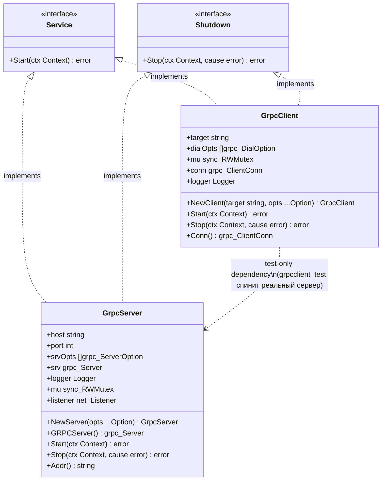

# Разделение пакета grpc на grpcserver и grpcclient

## Requirements

Разделить пакет `grpc` (содержащий `Server` и `Client`) на два независимых top-level пакета — `grpcserver` и `grpcclient`, устранив вынужденное разведение имён опций (`Option`/`ClientOption`, `WithLogger`/`WithClientLogger`) и приведя gRPC-примитивы тулкита к тому же уровню единообразия, что и существующая пара `httpserver`/`httpclient`.

## Entities



## Approach

1. **Разделение по пакетам, по прямой аналогии с `httpserver`/`httpclient`**:
   - Два новых плоских top-level пакета: `grpcserver/` (из `grpc/server.go` + `grpc/server_test.go`) и `grpcclient/` (из `grpc/client.go` + `grpc/client_test.go`)
   - Старый пакет `grpc/` удаляется полностью — без deprecated re-export shim. Библиотека без тегов версий и формального semver-контракта; проект придерживается принципа "не создавать backwards-compatibility hacks"
   - Перенос — чисто механический: сигнатуры, поля структур, логика методов не меняются, кроме пункта 2

2. **Схлопывание разведённых имён опций обратно к единому виду**:
   - В `grpcclient`: `ClientOption` → `Option`, `WithClientLogger` → переименовать в `WithLogger`
   - В `grpcserver`: `Option`, `WithLogger` и остальные идентификаторы остаются как есть — коллизии с `grpcclient` больше нет, т.к. пакеты разные
   - Итог: оба пакета получают идентичный по форме публичный API `Option`/`WithLogger`, симметрично `httpserver.Option`/`httpclient.Option`

3. **Тестовая связанность допустима, производственная — нет**:
   - `grpcclient/client_test.go` (`package grpcclient_test`) импортирует `grpcserver` для поднятия реального сервера в тестах клиента — сознательно принятый трейд-офф (аналогично тому, как `httpclient`-тесты полагаются на `httptest`)
   - Production-код `grpcserver` и `grpcclient` не должен импортировать друг друга ни в каком направлении

4. **Интеграция с proto-генерируемым кодом не меняется**: `GRPCServer()` и `Conn()` уже отдают сырые типы `google.golang.org/grpc` (`*grpc.Server`, `*grpc.ClientConn`), через которые регистрируются/используются сервисы, сгенерированные из `.proto`. Разделение пакетов на этот механизм не влияет — дополнительная документация не требуется

5. **Документация актуализируется в рамках той же задачи**:
   - `CLAUDE.md`, раздел "Структура" — заменить строку про `grpc/` на `grpcserver/` + `grpcclient/`
   - Синхронизация `docs/spdd/prompt/...-toolkit-aiomisc-primitives.md` (описывает старую структуру `grpc/`) через `/spdd-sync` — выполняется отдельным шагом после реализации, не входит в Operations этого prompt-файла

## Structure

### Inheritance Relationships
1. `service.Service` — контракт: `Start(ctx context.Context) error`
2. `service.Shutdown` — опциональный graceful stop: `Stop(ctx context.Context, cause error) error`
3. `*grpcserver.Server` реализует `service.Service` и `service.Shutdown`
4. `*grpcclient.Client` реализует `service.Service` и `service.Shutdown`

### Dependencies
1. `grpcserver` → `google.golang.org/grpc`, `net`, `log/slog`, `sync` (идентично текущему `grpc/server.go`)
2. `grpcclient` (production) → `google.golang.org/grpc`, `log/slog`, `sync` (идентично текущему `grpc/client.go`)
3. `grpcclient_test` (только тесты) → `grpcserver` — единственная межпакетная зависимость, ограничена тестовым кодом
4. `grpcserver` не зависит от `grpcclient` ни в каком виде

### Package Layout
```
grpcserver/   — Server (server.go, server_test.go)
grpcclient/   — Client (client.go, client_test.go)
```
Пакет `grpc/` удаляется целиком (`server.go`, `client.go`, `server_test.go`, `client_test.go`, директория).

## Operations

### 1. Создать `grpcserver/server.go`
1. Ответственность: перенос содержимого текущего `grpc/server.go` без изменения логики
2. Изменить только `package grpc` → `package grpcserver`
3. Структура, конструктор, методы (`NewServer`, `GRPCServer`, `Start`, `Stop`, `Addr`), опции (`Option`, `WithHost`, `WithPort`, `WithLogger`, `WithServerOptions`) — переносятся один в один, без переименований
4. Импорты не меняются (тот же набор: `context`, `fmt`, `log/slog`, `net`, `strconv`, `sync`, `grpclib "google.golang.org/grpc"`)

---

### 2. Создать `grpcserver/server_test.go`
1. Перенос содержимого `grpc/server_test.go`
2. `package grpc_test` → `package grpcserver_test`
3. Импорт `gkgrpc "github.com/DjaPy/gokit-services/grpc"` → `gkgrpc "github.com/DjaPy/gokit-services/grpcserver"` (либо без алиаса — на усмотрение реализации, главное чтобы вызовы `gkgrpc.NewServer`/`gkgrpc.WithPort`/... остались рабочими)
4. Тесты переносятся без изменения логики и таймаутов: `TestGrpcServer_StartStop`, `TestGrpcServer_Addr_BeforeStart`, `TestGrpcServer_Addr_AfterStart`, `TestGrpcServer_Stop_GracefulShutdown`, `TestGrpcServer_Stop_ForcefulOnCtxExpiry`, `TestGrpcServer_ContextCancelStops`

---

### 3. Создать `grpcclient/client.go`
1. Ответственность: перенос содержимого текущего `grpc/client.go` с переименованием типа опций
2. Изменить `package grpc` → `package grpcclient`
3. Переименовать `type ClientOption func(*Client)` → `type Option func(*Client)`
4. Переименовать `func WithClientLogger(l *slog.Logger) ClientOption` → `func WithLogger(l *slog.Logger) Option`
5. `func WithDialOptions(opts ...grpclib.DialOption) ClientOption` → тот же метод, тип возврата меняется на `Option` (без переименования самой функции)
6. `func NewClient(target string, opts ...ClientOption) *Client` → `func NewClient(target string, opts ...Option) *Client`
7. Остальная структура (`Client`, поля, `Start`, `Stop`, `Conn`) — без изменений логики
8. Импорты не меняются

---

### 4. Создать `grpcclient/client_test.go`
1. Перенос содержимого `grpc/client_test.go`
2. `package grpc_test` → `package grpcclient_test`
3. Импорт `gkgrpc "github.com/DjaPy/gokit-services/grpc"` заменяется двумя импортами:
   - `"github.com/DjaPy/gokit-services/grpcserver"` — для `grpcserver.NewServer(...)`, `grpcserver.WithPort(...)`, `grpcserver.WithHost(...)` (поднятие тестового сервера)
   - `"github.com/DjaPy/gokit-services/grpcclient"` — для `grpcclient.NewClient(...)`, `grpcclient.WithDialOptions(...)`
4. Обновить все вызовы в теле тестов согласно новым именам пакетов (`gkgrpc.NewServer` → `grpcserver.NewServer`, `gkgrpc.NewClient` → `grpcclient.NewClient` и т.д.)
5. Тесты переносятся без изменения логики: `TestGrpcClient_ConnAvailableAfterStart`, `TestGrpcClient_StopClosesConn`

---

### 5. Удалить пакет `grpc/`
1. Удалить файлы: `grpc/server.go`, `grpc/client.go`, `grpc/server_test.go`, `grpc/client_test.go`
2. Удалить пустую директорию `grpc/`
3. Проверить: нигде в репозитории не осталось импортов `github.com/DjaPy/gokit-services/grpc` (`grep -rn "gokit-services/grpc\"" .`)

---

### 6. Обновить `CLAUDE.md`
1. В разделе "Структура" заменить строку:
   ```
   grpc/         — gRPC клиент (в разработке)
   ```
   на:
   ```
   grpcserver/   — gRPC сервер
   grpcclient/   — gRPC клиент
   ```
2. Не менять остальные разделы `CLAUDE.md` — вне объёма этой задачи

---

### 7. Валидация
1. `go build ./...` — компиляция без ошибок
2. `go vet ./...` — без замечаний
3. `gofmt -l .` — пусто (нет неотформатированных файлов)
4. `go test ./...` — все тесты проходят, включая перенесённые `grpcserver`/`grpcclient`
5. `go test -race ./...` — без гонок
6. `golangci-lint run ./...` — 0 issues

## Norms

1. **Именование пакетов**: `grpcserver`, `grpcclient` — строчные, слитно, одним словом; соответствует общей конвенции проекта (`entrypoint`, `httpserver`, `httpclient`, `periodic`, `workerpool`, `healthserver`) без исключений
2. **Functional options**: единый `type Option func(*T)` на пакет, экспортируемый; `WithLogger(*slog.Logger)` — без вариаций имени между пакетами
3. **Чистый перенос без побочных изменений**: кроме переименования типа опций в `grpcclient` (пункт Operations #3), никакая другая логика, сигнатуры методов или поведение не меняются — это рефакторинг структуры пакетов, не поведения
4. **Тесты**: `package X_test` (black-box), реальные TCP-соединения на `127.0.0.1:0` (без `bufconn`), `require.Eventually` вместо `time.Sleep` для асинхронных состояний, контекст с таймаутом
5. **Проверка реализации интерфейсов**: не добавлять package-level `var _ Interface = (*T)(nil)` — соответствует установленному в репозитории паттерну избегания компиляционных ассертов
6. **Границы зависимостей**: `grpcclient_test` может зависеть от `grpcserver`; production-код `grpcserver` и `grpcclient` не зависят друг от друга ни в каком направлении
7. **Интеграция с proto-кодом не документируется отдельно**: паттерн `GRPCServer()`/`Conn()` уже задокументирован в существующих doc-комментариях кода, повторно не описывается

## Safeguards

1. **Функциональные ограничения**:
   - Поведение `Start`/`Stop`/`Addr`/`Conn`/`GRPCServer` не меняется — эта задача только перемещает код между пакетами и переименовывает тип опций клиента
   - Все 8 существующих тестов (6 server + 2 client) должны проходить после переноса с теми же ассертами

2. **Ограничения совместимости**:
   - Это осознанный breaking change публичного API: путь импорта `github.com/DjaPy/gokit-services/grpc` перестаёт существовать; потребители должны перейти на `grpcserver`/`grpcclient`
   - Deprecated re-export shim НЕ создаётся — явное решение, зафиксированное в analysis-файле

3. **Ограничения зависимостей**:
   - `grpcserver` не импортирует `grpcclient` (production и test код)
   - `grpcclient` (production-код, `client.go`) не импортирует `grpcserver`
   - `grpcclient_test` (только `client_test.go`) может импортировать `grpcserver` — единственное исключение

4. **API-контракты**:
   - `grpcserver.Option` и `grpcclient.Option` — два разных типа в разных пакетах, коллизия невозможна по построению
   - `grpcclient.WithLogger` заменяет `grpc.WithClientLogger` один в один по сигнатуре (`func(*slog.Logger) Option`)
   - `Conn()` в `grpcclient.Client` по-прежнему возвращает `nil` до `Start` — поведение не меняется

5. **Ограничения тестирования**:
   - Ни один тест не может быть удалён или объединён в рамках этой задачи — только перенесён с обновлёнными импортами/package-декларацией
   - `golangci-lint run ./...` должен показывать `0 issues` после переноса

6. **Ограничения документации**:
   - `CLAUDE.md` не должен содержать упоминаний единого пакета `grpc/` после завершения задачи
   - Синхронизация `docs/spdd/prompt/...-toolkit-aiomisc-primitives.md` выполняется отдельно, вне рамок Operations этого файла