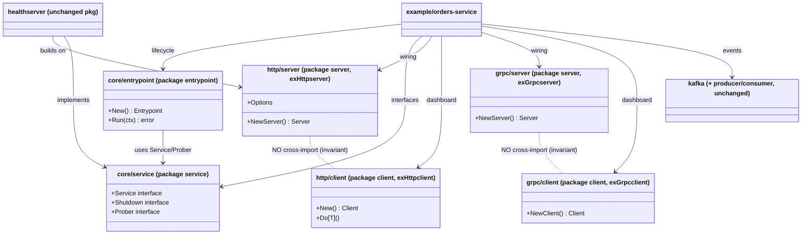

# Группировка транспортов http/grpc по образцу kafka и изоляция core-пакетов (entrypoint, service)

## Requirements

Реорганизовать раскладку пакетов тулкита `github.com/DjaPy/gokit-services` без единого изменения поведения:

- Сгруппировать транспортные пакеты по образцу существующего `kafka/`: `httpserver`/`httpclient` → `http/server`/`http/client`, `grpcserver`/`grpcclient` → `grpc/server`/`grpc/client`, сохранив инвариант независимости server/client (по аналогии с независимостью `kafka/producer` и `kafka/consumer`).
- Отделить контрактно-оркестрационный слой (`service`, `entrypoint`) от конкретных реализаций, вынеся его в группу `core/` (`core/service`, `core/entrypoint`).
- Инфраструктурные сервисы (`healthserver`, `periodic`, `workerpool`, `dbservice`, `redisservice`) и пакет `kafka/` остаются на верхнем уровне без изменений.

Ценность: единообразная, самодокументирующая раскладка (транспорт сгруппирован по протоколу, ядро отделено от реализаций), снижающая когнитивную нагрузку и делающая границы зависимостей явными. Это чистый рефакторинг компоновки — публичные API, сигнатуры, метрики и логика не меняются; меняются только пути импорта и объявления `package` у перемещённых пакетов.

**Definition of Done**: целевая раскладка достигнута; `go build ./... && go vet ./... && golangci-lint run ./... && go test -race ./...` зелёные (включая `example/`); инварианты зависимостей подтверждены; breaking-изменение задокументировано в `CHANGELOG.md` и выпущено как `v0.4.0`.

## Entities

«Сущности» здесь — пакеты и их зависимости, а не бизнес-типы. Диаграмма отражает целевой граф после реорга (стрелка = импортирует).



**Conservative constraint**: ни один тип, интерфейс, поле, сигнатура или метрика не создаётся, не удаляется и не переименовывается. Имена пакетов `service` и `entrypoint` сохраняются (меняется только путь импорта); имена пакетов транспортов меняются `httpserver`/`grpcserver` → `server`, `httpclient`/`grpcclient` → `client` (требование вложенной раскладки).

## Approach

1. **Стратегия перемещения**:
   - Использовать `git mv` для всех файлов, чтобы сохранить историю (не delete+create).
   - Разбить на два независимых движения: (A) вынос `core/`, (B) группировка `http/` и `grpc/`. Каждое движение оставляет дерево компилируемым до перехода к следующему — легче локализовать ошибку.
   - Порядок внутри движения: сначала переместить и переобъявить `package`, затем массово поправить пути импорта и идентификаторы у потребителей, затем прогнать гейт (`build`/`vet`/`lint`/`test`).

2. **Обработка смены имени пакета (транспорты)**:
   - Пакеты `httpserver`/`httpclient`/`grpcserver`/`grpcclient` меняют собственное имя на `server`/`client`. Чтобы имена `server`/`client` не коллизировали на местах вызова и не размывали читаемость, **у потребителей импортировать эти подпакеты только с алиасами**: `httpsrv`, `httpcli`, `grpcsrv`, `grpccli`. Тогда правка callsite сводится к замене префикса идентификатора (`httpserver.` → `httpsrv.` и т.д.), а форма кода остаётся узнаваемой.
   - `core/service` и `core/entrypoint` сохраняют имена пакетов `service`/`entrypoint`, поэтому у потребителей меняется **только строка импорта**, идентификаторы на местах вызова (`service.Service`, `entrypoint.New`) не трогаются.

3. **Инварианты и верификация**:
   - После реорга подтвердить `go list`-ом, что `http/server` не импортирует `http/client` (и симметрично для grpc), а `core/service`/`core/entrypoint` не импортируют ни один пакет-реализацию.
   - `example/` — крупнейший потребитель — правится в том же коммите; красный `go build ./...` до полной правки ожидаем и допустим только внутри работы, не на выходе.

4. **Релизная стратегия**:
   - Pre-1.0 чистая библиотека: breaking допустим в MINOR. Занести в `CHANGELOG.md` под `### Changed` с пометкой **BREAKING** (таблица старый→новый путь импорта). Выпуск — `v0.4.0` через `just release-minor`. Суффикс `/v2` в module path не требуется.

## Structure

### Целевая раскладка каталогов

```
core/
  service/       package service     (git mv service/)
  entrypoint/    package entrypoint  (git mv entrypoint/)
http/
  server/        package server      (git mv httpserver/, был package httpserver)
  client/        package client      (git mv httpclient/, был package httpclient)
grpc/
  server/        package server      (git mv grpcserver/, был package grpcserver)
  client/        package client      (git mv grpcclient/, был package grpcclient)
kafka/           без изменений
healthserver/ periodic/ workerpool/ dbservice/ redisservice/   без изменений
example/         пути импорта обновлены
```

### Соответствие путей импорта (старый → новый)

1. `github.com/DjaPy/gokit-services/service` → `.../core/service`
2. `github.com/DjaPy/gokit-services/entrypoint` → `.../core/entrypoint`
3. `github.com/DjaPy/gokit-services/httpserver` → `.../http/server`
4. `github.com/DjaPy/gokit-services/httpclient` → `.../http/client`
5. `github.com/DjaPy/gokit-services/grpcserver` → `.../grpc/server`
6. `github.com/DjaPy/gokit-services/grpcclient` → `.../grpc/client`

### Зависимости (после реорга, неизменны по смыслу)

1. `core/entrypoint` → `core/service` (единственная внутренняя зависимость core).
2. `healthserver` → `http/server` (алиас `httpsrv`) + `core/service`.
3. `kafka/consumer` → `kafka` + `workerpool` (не затрагивается).
4. `example/*` → `core/entrypoint`, `core/service`, `http/server`, `http/client`, `grpc/server`, `grpc/client`, `kafka/*`, инфра-пакеты.

### Инварианты слоёв

1. **Транспортный слой** (`http/*`, `grpc/*`, `kafka/*`): `server` и `client` внутри одной группы не импортируют друг друга.
2. **Core-слой** (`core/service`, `core/entrypoint`): не импортирует ни одну реализацию; связывается с реализациями только через интерфейсы `service.Service`/`Shutdown`/`Prober`.
3. **Слой реализаций/инфраструктуры** (`healthserver`, `periodic`, `workerpool`, `dbservice`, `redisservice`): могут зависеть от core и от транспортов, но не наоборот.

## Operations

Задачи строго упорядочены; после каждой группы прогонять `go build ./...`.

### O1 — Вынести core-слой (`service`, `entrypoint`)

1. Ответственность: переместить контрактный и оркестрационный пакеты в `core/`, сохранив имена пакетов.
2. Действия:
   - `git mv service core/service` — файл `core/service/service.go`, объявление `package service` без изменений.
   - `git mv entrypoint core/entrypoint` — файлы `core/entrypoint/entrypoint.go` (`package entrypoint`) и `core/entrypoint/entrypoint_test.go` (`package entrypoint_test`) без изменений имён.
   - В `core/entrypoint/entrypoint.go` обновить импорт `.../service` → `.../core/service`.
3. Обновить путь импорта (только строка импорта, идентификаторы не трогать) во всех потребителях `service`/`entrypoint`:
   - `healthserver/server.go`: `.../service` → `.../core/service`.
   - `example/orders-service/cmd/orders-service/main.go`: `.../entrypoint` → `.../core/entrypoint`, `.../service` → `.../core/service`.
   - `example/orders-service/serverkit/backends.go`: `.../service` → `.../core/service`.
   - Любой другой файл, найденный `grep -rl 'gokit-services/service\|gokit-services/entrypoint'`.
4. Проверка: `go build ./...` зелёный.

### O2 — Сгруппировать http (`httpserver`/`httpclient` → `http/server`/`http/client`)

1. Ответственность: перенести http-транспорт в группу `http/` со сменой имени пакета на `server`/`client`.
2. Действия:
   - `git mv httpserver http/server`; в `http/server/server.go` и `http/server/server_test.go` заменить `package httpserver` → `package server`.
   - `git mv httpclient http/client`; в `http/client/client.go` и `http/client/client_test.go` заменить `package httpclient` → `package client`.
3. Обновить потребителей (импорт с алиасом + замена префикса идентификатора):
   - `healthserver/server.go`: импорт `httpsrv "github.com/DjaPy/gokit-services/http/server"`; заменить все `httpserver.` → `httpsrv.` (`NewServer`, `Option`, `Server`, `With*`).
   - `example/orders-service/serverkit/httpwiring.go`: `httpsrv "…/http/server"` и `httpcli "…/http/client"`; заменить `httpserver.` → `httpsrv.`, `httpclient.` → `httpcli.`.
   - `example/orders-service/dashboard.go`: `httpcli "…/http/client"`; заменить `httpclient.` → `httpcli.` (включая `Do[T]`, `WithBody`, `Client`).
   - Обновить упоминания в doc-комментариях (`httpserver.NewServer` в `dashboard.go`, `httpapi.go`) на `httpsrv.NewServer`.
4. Проверка: `go build ./...` зелёный.

### O3 — Сгруппировать grpc (`grpcserver`/`grpcclient` → `grpc/server`/`grpc/client`)

1. Ответственность: перенести grpc-транспорт в группу `grpc/` со сменой имени пакета на `server`/`client`.
2. Действия:
   - `git mv grpcserver grpc/server`; заменить `package grpcserver` → `package server` (в `server.go`) и `package grpcserver_test` → `package server_test` (в `server_test.go`).
   - `git mv grpcclient grpc/client`; заменить `package grpcclient` → `package client` и `package grpcclient_test` → `package client_test`.
3. Обновить потребителей:
   - `example/orders-service/cmd/orders-service/main.go`: `grpcsrv "…/grpc/server"`, `grpccli "…/grpc/client"`; заменить `grpcserver.` → `grpcsrv.`, `grpcclient.` → `grpccli.`.
   - `example/orders-service/dashboard.go`: `grpccli "…/grpc/client"`; заменить `grpcclient.` → `grpccli.`.
4. Проверка: `go build ./...` зелёный.

### O4 — Верифицировать инварианты зависимостей

1. Ответственность: подтвердить, что реорг не создал запрещённых рёбер.
2. Проверки (каждая должна вернуть пустой результат / ожидаемое):
   - `go list -f '{{ join .Imports "\n" }}' ./http/server` не содержит `.../http/client`; симметрично `./http/client` не содержит `.../http/server`.
   - То же для `./grpc/server` и `./grpc/client`.
   - `go list -f '{{ join .Imports "\n" }}' ./core/service ./core/entrypoint` не содержит ни одного пакета-реализации (`http/*`, `grpc/*`, `kafka/*`, `healthserver`, `dbservice`, `redisservice`, `periodic`, `workerpool`).
   - `grep -rn 'gokit-services/\(httpserver\|httpclient\|grpcserver\|grpcclient\)\b'` и `grep -rn 'gokit-services/service\b\|gokit-services/entrypoint\b'` — не осталось старых путей.
3. Проверка: все условия выполнены.

### O5 — Прогнать полный гейт качества

1. Ответственность: убедиться в нулевом поведенческом регрессе.
2. Действия по порядку:
   - `go build ./...`
   - `go vet ./...`
   - `golangci-lint run ./...` (0 issues)
   - `go test -race ./...` (все пакеты зелёные, включая перемещённые `*_test.go` и `example/`)
3. Проверка: все команды успешны.

### O6 — Документировать breaking-изменение и подготовить релиз

1. Ответственность: зафиксировать разрыв обратной совместимости и подготовить выпуск.
2. Действия:
   - В `CHANGELOG.md` под `[Unreleased]` → `### Changed` добавить запись с пометкой **BREAKING**: таблица «старый путь импорта → новый» (6 строк из раздела Structure) + примечание про алиасы `server`/`client`.
   - Не запускать `just release-minor` без явного подтверждения пользователя (релиз — отдельный ручной шаг по политике `CLAUDE.md`).
3. Проверка: changelog обновлён; релиз согласован с пользователем как `v0.4.0`.

## Norms

1. **Перемещение файлов**: только `git mv` (сохранение истории). Никаких delete+create.
2. **Смена имени пакета vs пути**:
   - Транспорты меняют имя пакета (`server`/`client`) → у потребителей обязателен **import-алиас** `httpsrv`/`httpcli`/`grpcsrv`/`grpccli`; правка callsite = замена префикса идентификатора.
   - `core/service`, `core/entrypoint` сохраняют имя пакета → у потребителей меняется только строка импорта, идентификаторы неизменны.
3. **Алиасы (единый стиль)**: `httpsrv "…/http/server"`, `httpcli "…/http/client"`, `grpcsrv "…/grpc/server"`, `grpccli "…/grpc/client"`. Не использовать «голые» `server`/`client` на местах вызова во избежание коллизий и потери читаемости; так же снимается конфликт имени с stdlib `net/http`.
4. **Нулевое поведение**: запрещено в рамках этого рефактора менять сигнатуры, поля, имена экспортируемых типов/функций, тексты метрик, логику. Разрешены только: `package`-объявления перемещённых пакетов, строки импорта, префиксы идентификаторов через алиас, doc-комментарии, ссылающиеся на старые имена.
5. **Пошаговая компилируемость**: после каждой операции O1–O3 дерево должно собираться (`go build ./...`).
6. **Соответствие проектным конвенциям** (из `CLAUDE.md`/памяти): не добавлять compile-time interface assertions; не вводить магические числа; при правках тестов сохранять существующий стиль (`prometheus.NewRegistry()` в тестах серверов).

## Safeguards

1. **Функциональные**: набор экспортируемых идентификаторов каждого перемещённого пакета идентичен доменному до реорга (проверяемо `go doc` до/после или ревью диффа — переименований символов быть не должно).
2. **Инвариант независимости**: `http/server` ⊥ `http/client` и `grpc/server` ⊥ `grpc/client` — отсутствие взаимного импорта подтверждается `go list` (O4). Нарушение — блокер.
3. **Инвариант направления зависимостей**: `core/service` и `core/entrypoint` не импортируют ни одну реализацию (`go list`, O4). Нарушение — блокер.
4. **Полнота замены путей**: после реорга `grep` по старым путям импорта (`/httpserver`, `/httpclient`, `/grpcserver`, `/grpcclient`, корневые `/service`, `/entrypoint`) не находит ни одного вхождения в `.go`-файлах. Остаточная ссылка — блокер.
5. **Гейт качества**: `go build ./...`, `go vet ./...`, `golangci-lint run ./...` (0 issues), `go test -race ./...` (все пакеты) — все обязаны пройти. Любая красная команда — блокер выпуска.
6. **Целостность истории**: перемещённые файлы сохраняют git-историю (проверяемо `git log --follow`). Использование delete+create вместо `git mv` — нарушение.
7. **Совместимость**: изменение осознанно breaking для внешних консьюмеров; обязательна запись **BREAKING** в `CHANGELOG.md` с таблицей путей. Выпуск строго `v0.4.0` (MINOR, pre-1.0); повышать до иной версии или добавлять `/v2` в module path запрещено.
8. **Границы скоупа**: `kafka/`, `healthserver`, `periodic`, `workerpool`, `dbservice`, `redisservice` остаются на верхнем уровне и не переименовываются. Расширение реорга на эти пакеты в рамках данной задачи запрещено.
9. **Релизный контроль**: `just release-minor` не запускается без явного подтверждения пользователя (тег/пуш — ручной шаг).