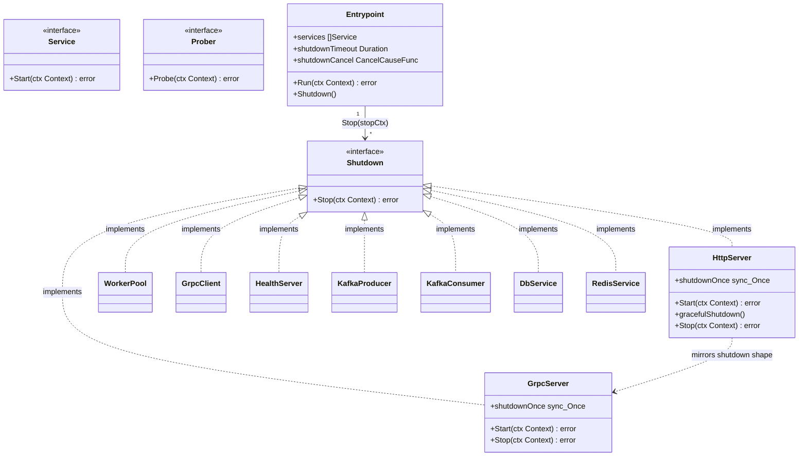

# Упрощение контракта остановки: `Stop(ctx)` без `cause` и единый shutdown-путь в http/server

## Requirements

Упростить контракт graceful-остановки тулкита `github.com/DjaPy/gokit-services`, убрав спекулятивную обобщённость и рассинхрон между транспортами:

- Убрать неиспользуемый параметр `cause error` из `service.Shutdown.Stop` — новая сигнатура `Stop(ctx context.Context) error`. Ни одна реализация никогда не потребляла `cause`, а причина остановки уже доступна как возвращаемое значение `entrypoint.Run`.
- Привести `http/server` к единому graceful-пути остановки по образцу `grpc/server`: один идемпотентный graceful-shutdown без собственного дедлайна, а дедлайн приходит из контекста `Stop`. Это чинит два дефекта: `entrypoint.WithShutdownTimeout` фактически не влиял на HTTP-сервер (побеждал захардкоженный 5s-путь в `Start`), и утечку горутины-наблюдателя в `Start`.

**Ценность**: меньше поверхности API (нет мёртвого параметра), единообразное поведение остановки http/grpc, авторитетный и детерминированный таймаут остановки.

**Definition of Done**: сигнатура `Stop(ctx) error` во всём дереве; `http/server` структурно повторяет `grpc/server`; `go build ./... && go vet ./... && go test -race ./...` зелёные (включая `example/`); breaking-изменение сигнатуры и поведенческий сдвиг задокументированы в `CHANGELOG.md`; выпущено как `v0.5.0`.

## Entities

«Сущности» здесь — контракт `service` и реализации, затронутые изменением сигнатуры.



## Approach

1. **`cause` — YAGNI, а не необходимая концепция**:
   - Ни одна из 11 реализаций `Stop` не читала `cause` (все принимали `_ error` либо форвардили во внутренний тип, который тоже отбрасывал).
   - Идиоматичный способ донести причину остановки в Go — это возврат, а не входной параметр: `entrypoint.Run` уже вычисляет `shutdownCause` (через `context.WithCancelCause`/`context.Cause`) и **возвращает** её вызывающему. Дублировать её как аргумент `Stop` избыточно.
   - Удаление — чистое сокращение поверхности API; внутренний механизм `shutdownCause` в `entrypoint` сохраняется без изменений (это не удаляемый параметр, а его замена).

2. **Единый shutdown-путь в http/server по образцу grpc/server**:
   - Исходно `http/server` имел **два** пути остановки: горутина в `Start` по `ctx.Done()` вызывала `server.Shutdown` с **захардкоженным 5s** под `shutdownOnce`, и отдельный `Stop(ctx)`.
   - Под `entrypoint` порядок такой: `svcCancel()` отменяет `svcCtx` → горутина из `Start` почти всегда выигрывает гонку за `shutdownOnce` → применяется 5s, а `stopCtx` из `Stop` (построенный из `WithShutdownTimeout`) игнорируется. Итог — настраиваемый таймаут не работает, что является скрытым сюрпризом.
   - Дополнительно `go func() { <-ctx.Done(); ... }()` в `Start` **утекала**, если сервер останавливали через `Stop` без отмены ctx (горутина навсегда висла на `<-ctx.Done()`).
   - `grpc/server` уже решает это правильно: единый graceful-путь без своего дедлайна, а `Stop` бьёт дедлайном из ctx через принудительное завершение. Переносим ту же структуру на `http/server`: graceful = `server.Shutdown(context.Background())`, force = `server.Close()`.

3. **Совместимость и порядок**:
   - Смена сигнатуры `Stop` — breaking change публичного API (pre-1.0, допустим в MINOR с пометкой **BREAKING**).
   - Поведенческий сдвиг http/server standalone (неограниченный graceful-дренаж вместо жёстких 5s) — задокументировать в doc-комментарии `Start` и в `CHANGELOG` как `Changed`/`Fixed`, не как breaking API.

## Structure

### Затронутый контракт
1. `service.Shutdown` — сигнатура меняется на `Stop(ctx context.Context) error` (убран `cause error`).
2. `service.Service` и `service.Prober` — не затрагиваются.

### Реализации `Stop`, приводимые к новой сигнатуре
`pkg/core/service` (интерфейс) + 11 реализаций:
`pkg/http/server`, `pkg/grpc/server`, `pkg/grpc/client`, `pkg/healthserver`,
`pkg/workerpool`, `pkg/kafka/producer`, `pkg/kafka/consumer`, `pkg/dbservice`,
`pkg/redisservice`, и 2 тестовые реализации в `pkg/core/entrypoint/entrypoint_test.go`.

### Затронутые вызовы
- `pkg/core/entrypoint/entrypoint.go` — `stopper.Stop(stopCtx)`.
- `pkg/healthserver/server.go` — `s.inner.Stop(ctx)`.
- `pkg/kafka/consumer/consumer.go` — `pool.Stop(ctx)`.
- Все тестовые call-sites `.Stop(ctx, nil)` → `.Stop(ctx)`.

### Дедлайн остановки
`entrypoint` строит `stopCtx = context.WithTimeout(context.WithoutCancel(ctx), shutdownTimeout)` и передаёт его в `Stop`. После рефакторинга http/server именно этот ctx становится авторитетным ограничителем graceful-дренажа (через force-`Close`).

## Operations

### 1. Убрать `cause` из `service.Shutdown`

1. Ответственность: контракт опционального graceful-стопа.
2. `pkg/core/service/service.go`:
   ```go
   // Shutdown is an optional interface a service may implement to perform
   // cleanup during graceful shutdown. Stop is called with a context bounded
   // by the entrypoint's shutdown timeout.
   type Shutdown interface {
       Stop(ctx context.Context) error
   }
   ```
3. Обновить docstring: убрать упоминание причины/`cause`.

---

### 2. Привести 11 реализаций и вызовы к `Stop(ctx) error`

1. В каждой реализации убрать второй параметр (`_ error` / `cause error`):
   `http/server`, `grpc/server`, `grpc/client`, `healthserver`, `workerpool`,
   `kafka/producer` (`Stop(_ context.Context)`), `kafka/consumer`,
   `dbservice`, `redisservice` (`Stop(_ context.Context)`), 2 тестовых стопера.
2. Обновить внутренние вызовы: `entrypoint` → `stopper.Stop(stopCtx)`;
   `healthserver` → `s.inner.Stop(ctx)`; `kafka/consumer` → `pool.Stop(ctx)`.
3. Обновить все тестовые call-sites: `.Stop(ctx, nil)` → `.Stop(ctx)`.
4. `entrypoint`: сохранить внутренний `context.WithCancelCause`/`shutdownCancel`/
   `shutdownCause` — они не удаляются, `Run` по-прежнему возвращает `shutdownCause`.
5. Проверить: `go build ./... && go vet ./... && go test -race ./...` зелёные.

---

### 3. Единый graceful-путь в `http/server`

1. Ответственность: одна идемпотентная реализация graceful-shutdown без собственного дедлайна, разделяемая ctx-путём в `Start` и методом `Stop`.
2. Вынести хелпер:
   ```go
   func (s *Server) gracefulShutdown() {
       s.shutdownOnce.Do(func() {
           if err := s.server.Shutdown(context.Background()); err != nil {
               s.logger.Error("graceful shutdown", slog.String("error", err.Error()))
           }
       })
   }
   ```
3. `Start`: убрать захардкоженный `Shutdown(5s)`; следить за ctx через `wg.Go`+`quit`-канал (как в `grpc/server`), чтобы не утекать горутину:
   ```go
   quit := make(chan struct{})
   var wg sync.WaitGroup
   wg.Go(func() {
       select {
       case <-ctx.Done():
           s.gracefulShutdown()
       case <-quit:
       }
   })
   err = s.server.Serve(ln)
   close(quit)
   wg.Wait()
   if err != nil && !errors.Is(err, http.ErrServerClosed) {
       return fmt.Errorf("serving: %w", err)
   }
   return nil
   ```
4. Обновить doc-комментарий `Start`: при отмене ctx — graceful-дренаж без своего дедлайна; ограничение приходит из `Stop`; standalone-вызов для ограниченной остановки должен звать `Stop(ctx)` с дедлайном.

---

### 4. `http/server.Stop` — зеркало `grpc/server.Stop`

1. Ответственность: graceful-дренаж, ограниченный ctx; при истечении ctx — форс `server.Close()` и возврат `ctx.Err()`.
2. Реализация:
   ```go
   func (s *Server) Stop(ctx context.Context) error {
       s.logger.Info("HTTP server stopping")

       if err := ctx.Err(); err != nil { // ранний детерминизм (как в grpc, v0.4.1)
           if closeErr := s.server.Close(); closeErr != nil {
               s.logger.Error("forced close", slog.String("error", closeErr.Error()))
           }
           return fmt.Errorf("http server stop: %w", err)
       }

       done := make(chan struct{})
       var wg sync.WaitGroup
       wg.Go(func() { s.gracefulShutdown(); close(done) })
       select {
       case <-done:
           wg.Wait()
           return nil
       case <-ctx.Done():
           if err := s.server.Close(); err != nil {
               s.logger.Error("forced close", slog.String("error", err.Error()))
           }
           wg.Wait()
           return fmt.Errorf("http server stop: %w", ctx.Err())
       }
   }
   ```
3. Поправить неверные doc-комментарии `service.Stopper` → `service.Shutdown`.
4. Проверить, что `TestServer_StartStop` и `TestServer_ContextCancellationStops` проходят с `-race` без опоры на 5s.

---

### 5. Обновить `CHANGELOG.md`

1. `### Changed` → **BREAKING**: смена сигнатуры `Stop` (с миграцией `Stop(ctx, cause)` → `Stop(ctx)`).
2. `### Changed` → поведенческий сдвиг http/server standalone (неограниченный graceful-дренаж).
3. `### Fixed` → `WithShutdownTimeout` теперь управляет остановкой HTTP-сервера; починка утечки горутины-наблюдателя.

## Norms

1. **Причина остановки — через возврат, не через параметр**: `entrypoint.Run` возвращает `shutdownCause`; `Stop` не получает её аргументом.
2. **Единый идемпотентный shutdown**: graceful-путь ровно один, под `sync.Once`; оба триггера (отмена ctx в `Start`, вызов `Stop`) идут через него.
3. **Дедлайн — из ctx `Stop`**: graceful-дренаж без собственного таймаута; ограничение задаёт вызывающий через контекст (под `entrypoint` — `WithShutdownTimeout`).
4. **`sync.WaitGroup.Go`** для горутины-наблюдателя и force-горутины; никакого ручного `Add/Done`.
5. **`quit`-канал** в `Start` для гарантированного завершения горутины-наблюдателя после обычного возврата `Serve` (нет утечки).
6. **Обёртка ошибок** через `%w`; форс-`Close` логируется, не подменяет возвращаемую `ctx.Err()`.
7. **Проверка интерфейсов** — рантайм внутри тестов, не package-level `var _`.

## Safeguards

1. **Функциональные ограничения**:
   - `Stop(ctx)` при уже истёкшем ctx детерминированно форсит `Close()` и возвращает `ctx.Err()` (аналог раннего ветвления `grpc/server`, зафиксированного в v0.4.1) — без ухода в graceful-путь.
   - Повторный вызов `Stop` безопасен (idempotent через `shutdownOnce`).
   - `Start` возвращает `nil` при штатной остановке (`http.ErrServerClosed` отфильтрован).
2. **Ограничения производительности / ресурсов**:
   - Нет утечки горутины-наблюдателя: `quit`-канал закрывается после возврата `Serve`.
   - Под `entrypoint` force-`Close` гарантирует, что зависшие соединения не удержат остановку дольше `WithShutdownTimeout`.
3. **Ограничения совместимости**:
   - **BREAKING (API)**: `Stop(ctx context.Context) error` — все внешние реализации и вызовы `Stop(ctx, cause)` должны обновиться (pre-1.0, MINOR, помечено в `CHANGELOG`).
   - **BREAKING (поведение, не API)**: standalone http/server при отмене ctx делает неограниченный graceful-дренаж вместо жёстких 5s; для ограниченной остановки — `Stop(ctx)` с дедлайном (документировано в `Start`).
   - Внутренний механизм `shutdownCause` в `entrypoint` не меняется — возврат `Run` сохраняет причину остановки.
4. **Ограничения тестирования**:
   - Тесты `http/server` не опираются на конкретное значение таймаута; проверяют поведение (ctx-cancel останавливает; `Stop` возвращает без ошибки) под `-race`.
   - Изолированный `prometheus.NewRegistry()` в тестах с метриками.
5. **Порядок реализации**:
   - Сначала интерфейс `service.Shutdown`, затем реализации и вызовы, затем рефакторинг `http/server`, затем `CHANGELOG`.
