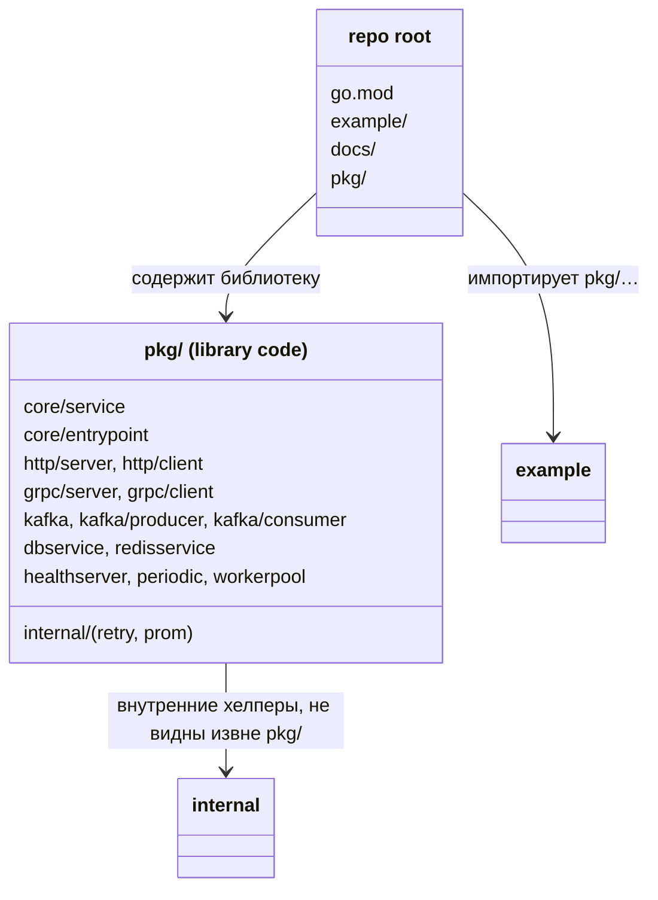

# Перенос библиотечного кода под `pkg/`: разгрузка корня репозитория

## Requirements

Убрать библиотечный код тулкита `github.com/DjaPy/gokit-services` с верхнего уровня репозитория в отдельную директорию `pkg/`, без единого изменения поведения:

- Все библиотечные пакеты (`core/`, `http/`, `grpc/`, `kafka/`, `dbservice`, `redisservice`, `healthserver`, `periodic`, `workerpool`, `internal/`) переезжают под `pkg/`.
- `example/` и `docs/` остаются на верхнем уровне рядом с `pkg/`.
- Путь модуля и версионирование не меняются: `go.mod` остаётся в корне, теги — `vX.Y.Z` без префиксов, релизная оснастка (`justfile`, `release.yml`) не трогается.

Ценность: корень репозитория перестаёт смешивать библиотеку, пример и документацию на одном уровне; граница «что является библиотекой» становится явной (`pkg/`), а `pkg/internal/` перестаёт быть импортируемым потребителями за пределами `pkg/`.

**Definition of Done**: целевая раскладка достигнута; каждый импорт получает сегмент `pkg/`; публичные API, имена пакетов, сигнатуры и метрики неизменны; `go build ./... && go vet ./... && golangci-lint run ./... && go test -race ./...` зелёные (включая `example/`); `gofmt` чист; breaking-изменение путей задокументировано в `CHANGELOG.md` и выпущено как `v0.5.0`.

## Entities

«Сущности» здесь — пакеты и их расположение, а не бизнес-типы. Таблица переноса (старый путь → новый):

| Старый путь | Новый путь |
|-------------|------------|
| `github.com/DjaPy/gokit-services/core/…` | `github.com/DjaPy/gokit-services/pkg/core/…` |
| `github.com/DjaPy/gokit-services/http/…` | `github.com/DjaPy/gokit-services/pkg/http/…` |
| `github.com/DjaPy/gokit-services/grpc/…` | `github.com/DjaPy/gokit-services/pkg/grpc/…` |
| `github.com/DjaPy/gokit-services/kafka/…` | `github.com/DjaPy/gokit-services/pkg/kafka/…` |
| `github.com/DjaPy/gokit-services/dbservice` | `github.com/DjaPy/gokit-services/pkg/dbservice` |
| `github.com/DjaPy/gokit-services/redisservice` | `github.com/DjaPy/gokit-services/pkg/redisservice` |
| `github.com/DjaPy/gokit-services/healthserver` | `github.com/DjaPy/gokit-services/pkg/healthserver` |
| `github.com/DjaPy/gokit-services/periodic` | `github.com/DjaPy/gokit-services/pkg/periodic` |
| `github.com/DjaPy/gokit-services/workerpool` | `github.com/DjaPy/gokit-services/pkg/workerpool` |



## Approach

1. **Почему `pkg/`, а не go.mod в подпапке**:
   - Рассматривался вариант с отдельным `go.mod` в подпапке библиотеки — отвергнут: он требует тегов с префиксом (`lib/vX.Y.Z`) и `go.work`, что сложнее.
   - `pkg/` держит единственный `go.mod` в корне: теги остаются `vX.Y.Z`, потребители пинят версию как обычно (`@vX.Y.Z`), релизная оснастка не меняется.
   - В Go путь импорта выводится из расположения директории относительно `go.mod`, поэтому перенос директории — неизбежный breaking change путей импорта (имена пакетов и API при этом не меняются).

2. **Механический перенос без изменения поведения**:
   - Переместить директории под `pkg/`, обновить объявления `package` не требуется (имена пакетов сохраняются), обновить только пути импорта.
   - Обновить импорты во всех библиотечных пакетах и в `example/`.
   - `pkg/internal/` остаётся `internal`-пакетом — теперь его область видимости сужена до `pkg/`; проверить, что `example/` не импортирует `internal` (иначе перенос сломает сборку).

3. **Форматирование импортов**:
   - После переноса `gofmt` может пометить файлы `example/` как неотформатированные из-за порядка импортов: `pkg/…` сортируется после `example/…` внутри группы. Прогнать `gofmt -w pkg example`.

4. **Совместимость и релиз**:
   - Breaking change путей — pre-1.0, допустим в MINOR с пометкой **BREAKING** и таблицей миграции в `CHANGELOG`.
   - Выпуск в составе `v0.5.0`.

## Structure

### Целевая раскладка
```
go.mod                 — в корне, путь модуля неизменен
example/               — рядом с pkg/, импортирует pkg/…
docs/                  — рядом с pkg/
pkg/
  core/
    service/           — Service, Shutdown, Prober
    entrypoint/        — жизненный цикл
  http/server, http/client
  grpc/server, grpc/client
  kafka/, kafka/producer, kafka/consumer
  dbservice/, redisservice/
  healthserver/, periodic/, workerpool/
  internal/            — retry, prom (видны только внутри pkg/)
```

### Инварианты зависимостей (сохраняются)
1. Направление зависимостей одностороннее: листовые сервисы → `core/service` ← `core/entrypoint`.
2. `entrypoint` зависит только от интерфейсов, не от конкретных транспортов.
3. Транспорты (`http`, `grpc`, `kafka`) не зависят друг от друга.
4. `pkg/internal/` импортируется только внутри `pkg/`; `example/` его не импортирует.

## Operations

### 1. Переместить библиотечные пакеты под `pkg/`

1. Ответственность: перенести директории, сохранив имена пакетов.
2. Перенести: `core/`, `http/`, `grpc/`, `kafka/`, `dbservice/`, `redisservice/`,
   `healthserver/`, `periodic/`, `workerpool/`, `internal/` → под `pkg/`.
3. Оставить в корне: `example/`, `docs/`, `go.mod`, `justfile`, `CHANGELOG.md`, `README.md` и прочие проектные файлы.
4. Объявления `package` не трогать — имена пакетов не меняются.

---

### 2. Обновить пути импорта

1. Во всех перенесённых пакетах и в `example/` заменить `github.com/DjaPy/gokit-services/<X>` → `github.com/DjaPy/gokit-services/pkg/<X>` по таблице переноса.
2. Сохранить алиасы импорта (`httpsrv`, `httpcli`, `grpcsrv`, `grpccli`) — они не зависят от пути.
3. `go mod tidy` при необходимости (путь модуля неизменен, новых зависимостей нет).

---

### 3. Проверить изоляцию `internal`

1. Убедиться, что `example/` не импортирует `pkg/internal/…` — иначе сборка `example/` сломается после сужения видимости.
2. Подтвердить, что все потребители `internal/prom` и `internal/retry` лежат внутри `pkg/`.

---

### 4. Форматирование и проверки

1. `gofmt -w pkg example` — устранить перескок порядка импортов (`pkg/…` сортируется после `example/…`).
2. Прогнать `go build ./... && go vet ./... && golangci-lint run ./... && go test -race ./...` — всё зелёное, включая `example/`.

---

### 5. Обновить документацию и `CHANGELOG.md`

1. `CHANGELOG.md`: `### Changed` → **BREAKING** с таблицей миграции путей.
2. Синхронизировать `CLAUDE.md`, `README.md`, `ARCHITECTURE.md` на префикс `pkg/` в деревьях и путях импорта.

## Norms

1. **Единственный `go.mod` в корне**: версионирование только через git-теги `vX.Y.Z`, без префиксов и `go.work`.
2. **Имена пакетов неизменны**: рефакторинг меняет только пути импорта, не идентификаторы пакетов и не публичный API.
3. **`internal` под `pkg/`**: общие хелперы (`retry`, `prom`) не импортируемы потребителями библиотеки.
4. **Алиасы транспортов** (`httpsrv`/`httpcli`/`grpcsrv`/`grpccli`) сохраняются для избежания коллизий и клэша со stdlib `net/http`.
5. **`gofmt` чист** после переноса; порядок импортов приведён к стандарту.

## Safeguards

1. **Функциональные ограничения**:
   - Поведение, сигнатуры, метрики и имена пакетов не меняются — это чистый рефакторинг компоновки.
2. **Ограничения совместимости**:
   - **BREAKING (пути импорта)**: каждый импорт получает сегмент `pkg/`; потребители обновляют импорты по таблице миграции (pre-1.0, MINOR, помечено в `CHANGELOG`).
   - Путь модуля и теги не меняются: `go get @vX.Y.Z` работает как прежде; переход на `/v2` не требуется (мажор не растёт).
3. **Ограничения зависимостей**:
   - Новых записей в `go.mod` не добавляется.
   - `pkg/internal/` не импортируется из `example/`.
4. **Ограничения тестирования**:
   - `go test -race ./...` зелёный, включая `example/`.
   - Инварианты направления зависимостей подтверждены после переноса.
5. **Порядок реализации**:
   - Перенос директорий → обновление импортов → проверка изоляции `internal` → `gofmt` → сборка/линт/тесты → документация и `CHANGELOG`.
