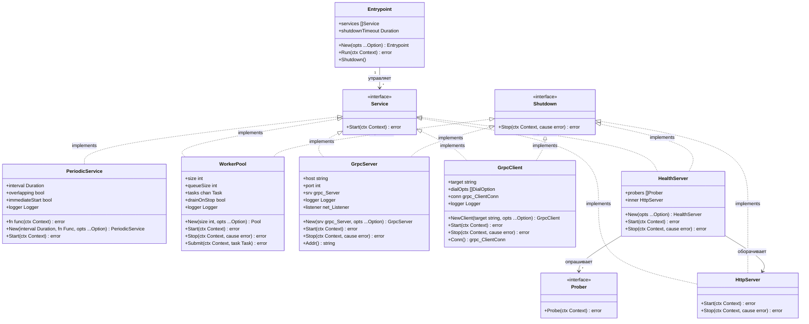

# Go-тулкит: примитивы aiomisc (PeriodicService, WorkerPool, GrpcServer, HealthServer)

## Requirements

Расширить существующий Go-тулкит (`github.com/DjaPy/gokit-services`) четырьмя новыми управляемыми примитивами — `PeriodicService`, `WorkerPool`, `GrpcServer/GrpcClient`, `HealthServer` — сохраняя установленные контракты `service.Service` и `service.Shutdown`, паттерн functional options, `slog` для логирования и минимальный граф зависимостей. Каждый примитив должен быть независимо подключаемым и работать как в составе `Entrypoint`, так и автономно.

## Entities



## Approach

1. **Следование существующим паттернам**:
   - Каждый новый тип реализует `service.Service`; `service.Shutdown` — там, где нужен graceful stop
   - Конфигурация — только через `type Option func(*T)` в каждом пакете; поля структур не экспортируются
   - Логирование — `slog.Default()` по умолчанию, `WithLogger(*slog.Logger)` для переопределения
   - Компиляционные гарантии: `var _ service.Service = (*T)(nil)` для каждого нового типа
   - Тесты: black-box пакет (`package X_test`), реальные TCP-соединения, `require.Eventually` для асинхронного состояния, контекст с таймаутом вместо `time.Sleep`

2. **`sync.WaitGroup.Go` везде вместо ручного `Add/Done`**:
   - Проект использует Go 1.26; `wg.Go(fn)` доступен с Go 1.25
   - Все горутины запускаются через `wg.Go(func() { ... })` — убирает ручной `wg.Add(1)` и `defer wg.Done()`
   - Применяется в WorkerPool (воркеры), PeriodicService (overlapping-тики) и GrpcServer (shutdown-горутина)

3. **Нулевые внешние зависимости для PeriodicService и WorkerPool**:
   - Реализация на stdlib: `time.Ticker`, горутины, каналы, `sync.WaitGroup`, `sync/atomic`
   - Никаких новых записей в `go.mod` для этих двух пакетов

4. **gRPC в одном модуле**:
   - `google.golang.org/grpc` добавляется как прямая зависимость в `go.mod`
   - Пакет `grpc/` заполняет существующий стаб (`grpc/client.go` — пустой `package grpc`)
   - `GrpcServer` и `GrpcClient` живут в одном пакете `grpc`
   - Для тестовой изоляции использовать `google.golang.org/grpc/test/bufconn`

5. **HealthServer как тонкая обёртка**:
   - Внутри использует `httpserver.NewServer` — не дублирует HTTP-логику и метрики
   - `/healthz` (liveness): всегда 200, пока сервер отвечает
   - `/readyz` (readiness): параллельно опрашивает все `service.Prober`; 200 если все nil, 503 + список ошибок если есть failure

6. **Shared internal утилита**:
   - Перенести `registerOrReuse[T prometheus.Collector]` из `httpserver/server.go` в `internal/prom/register.go`
   - Обновить импорт в `httpserver`; публичный API httpserver не меняется

## Structure

### Inheritance Relationships
1. `service.Service` — контракт: `Start(ctx context.Context) error`
2. `service.Shutdown` — опциональный graceful stop: `Stop(ctx context.Context, cause error) error`
3. `service.Prober` (новый) — опциональный health check: `Probe(ctx context.Context) error`
4. `*periodic.Service` реализует `service.Service`
5. `*workerpool.Pool` реализует `service.Service` и `service.Shutdown`
6. `*grpc.Server` реализует `service.Service` и `service.Shutdown`
7. `*grpc.Client` реализует `service.Service` и `service.Shutdown`
8. `*healthserver.Server` реализует `service.Service` и `service.Shutdown`

### Dependencies
1. `periodic.Service` → `time.Ticker`, `slog.Logger`, `sync.WaitGroup`, `sync/atomic` (только stdlib)
2. `workerpool.Pool` → `sync.WaitGroup`, buffered channel, `slog.Logger` (только stdlib)
3. `grpc.Server` → `google.golang.org/grpc`, `net.Listener`, `slog.Logger`
4. `grpc.Client` → `google.golang.org/grpc`, `slog.Logger`
5. `healthserver.Server` → `httpserver.Server`, `service.Prober`, `net/http`
6. `httpserver.Server` и новые metric-bearing пакеты → `internal/prom`

### Package Layout
```
periodic/         — PeriodicService (service.go, service_test.go)
workerpool/       — WorkerPool (pool.go, pool_test.go)
grpc/             — GrpcServer + GrpcClient (server.go, client.go, server_test.go, client_test.go)
healthserver/     — HealthServer (server.go, server_test.go)
internal/prom/    — registerOrReuse helper (register.go)
service/          — добавить Prober интерфейс в service.go
```

## Operations

### 1. Добавить `Prober` в `service/service.go`

1. Ответственность: опциональный интерфейс для участия сервиса в readiness-проверке
2. Добавить после существующих интерфейсов:
   ```go
   type Prober interface {
       Probe(ctx context.Context) error
   }
   ```
3. Интерфейс опциональный — существующие реализации `Service` и `Shutdown` не затрагиваются

---

### 2. Создать `internal/prom/register.go`

1. Ответственность: обобщённый хелпер регистрации коллектора без паники на дублях — переиспользуется всеми пакетами с метриками
2. Перенести из `httpserver/server.go`:
   ```go
   func RegisterOrReuse[T prometheus.Collector](reg prometheus.Registerer, c T) T {
       if err := reg.Register(c); err != nil {
           var are prometheus.AlreadyRegisteredError
           if errors.As(err, &are) {
               return are.ExistingCollector.(T)
           }
           panic(err)
       }
       return c
   }
   ```
3. Обновить `httpserver/server.go`: заменить вызов приватной `registerOrReuse` на `prom.RegisterOrReuse`
4. Проверить: `go test ./...` проходит без изменений после рефакторинга

---

### 3. Реализовать `periodic/service.go`

1. Ответственность: запускать `fn(ctx)` с заданным интервалом; по умолчанию non-overlapping (пропустить тик, если предыдущий ещё выполняется)

2. Структура:
   ```go
   type Service struct {
       interval       time.Duration
       fn             func(context.Context) error
       overlapping    bool
       immediateStart bool
       logger         *slog.Logger
   }
   ```

3. Конструктор:
   ```go
   func New(interval time.Duration, fn func(context.Context) error, opts ...Option) *Service
   ```

4. `Start(ctx context.Context) error`:
   - Если `immediateStart` — вызвать `fn(ctx)` синхронно до запуска тикера
   - Запустить `time.NewTicker(interval)`, defer `ticker.Stop()`
   - **Non-overlapping**: `atomic.Bool` как busy-флаг
     - При тике: если busy = true → `logger.Warn("periodic: пропуск тика")`, continue
     - Иначе: `busy.Store(true)` → `fn(ctx)` синхронно → `busy.Store(false)`
     - Ошибки fn: логировать через `logger.Error`, сервис продолжает работать
   - **Overlapping**: использовать `sync.WaitGroup`; на каждый тик:
     ```go
     wg.Go(func() {
         if err := fn(ctx); err != nil {
             logger.Error("periodic fn error", "error", err)
         }
     })
     ```
     При `<-ctx.Done()` — дождаться `wg.Wait()` перед возвратом nil
   - При `<-ctx.Done()` в non-overlapping — вернуть nil немедленно (текущий fn завершится сам)

5. Options:
   - `WithOverlapping()` — включить параллельные тики
   - `WithImmediateStart()` — вызвать fn сразу при старте
   - `WithLogger(*slog.Logger)`

6. Компиляционная гарантия: `var _ service.Service = (*Service)(nil)`

---

### 4. Создать `periodic/service_test.go`

Пакет: `package periodic_test`

1. **TestPeriodic_CallbackCalledMultipleTimes**: запустить с интервалом 10ms, контекст на 55ms, проверить что fn вызвалась ≥ 4 раз (атомарный счётчик)
2. **TestPeriodic_NonOverlapping_SkipsTick**: fn с задержкой 30ms, интервал 10ms; за 60ms fn должна вызваться не более 2 раз
3. **TestPeriodic_ImmediateStart**: fn вызывается до первого тика — счётчик > 0 сразу в начале Start
4. **TestPeriodic_StopsOnCtxCancel**: после отмены ctx fn больше не вызывается
5. **TestPeriodic_ErrorInFn_DoesNotStop**: fn всегда возвращает ошибку; сервис работает до отмены ctx (не падает)

---

### 5. Реализовать `workerpool/pool.go`

1. Ответственность: ограниченный пул горутин-воркеров; `Submit` блокирует вызывающего при заполненной очереди до появления места или отмены ctx

2. Структура:
   ```go
   type Task func(ctx context.Context)

   type Pool struct {
       size        int
       tasks       chan Task
       wg          sync.WaitGroup
       drainOnStop bool
       logger      *slog.Logger
   }
   ```

3. Конструктор:
   ```go
   func New(size int, opts ...Option) *Pool
   ```
   - `queueSize` по умолчанию = `size * 2`; переопределяется через `WithQueueSize(n int)`
   - `tasks = make(chan Task, queueSize)`

4. `Start(ctx context.Context) error`:
   - Запустить `size` воркер-горутин через `wg.Go`:
     ```go
     for range p.size {
         p.wg.Go(func() {
             for task := range p.tasks {
                 task(ctx)
             }
         })
     }
     ```
   - Заблокировать до `<-ctx.Done()`
   - Закрыть канал `tasks` — воркеры дочитают очередь (range drain) и завершатся
   - Если `drainOnStop` — дождаться `p.wg.Wait()` перед возвратом
   - Вернуть nil

5. `Stop(ctx context.Context, _ error) error`:
   - Если `drainOnStop` — ждать `p.wg.Wait()` с учётом `ctx.Done()`; при таймауте вернуть `ctx.Err()`
   - Иначе — вернуть nil немедленно (Stop — no-op, дренаж управляется через Start/ctx)

6. `Submit(ctx context.Context, task Task) error`:
   ```go
   select {
   case p.tasks <- task:
       return nil
   case <-ctx.Done():
       return ctx.Err()
   }
   ```
   Блокирует до появления места в канале или отмены ctx. Не отслеживает выполнение через wg — воркеры уже запущены и управляются через `wg.Go` в `Start`.

7. Options:
   - `WithQueueSize(n int)`
   - `WithDrainOnStop()`
   - `WithLogger(*slog.Logger)`

8. Компиляционные гарантии:
   ```go
   var _ service.Service  = (*Pool)(nil)
   var _ service.Shutdown = (*Pool)(nil)
   ```

---

### 6. Создать `workerpool/pool_test.go`

Пакет: `package workerpool_test`

1. **TestPool_AllTasksExecuted**: submit 100 задач в пул size=5, дождаться выполнения через `require.Eventually`, проверить атомарный счётчик = 100
2. **TestPool_Submit_BlocksOnFullQueue**: заполнить очередь задачами с задержкой; Submit с отменённым ctx должен вернуть `ctx.Err()` немедленно
3. **TestPool_DrainOnStop_WaitsForTasks**: задачи с задержкой; контекст отменяется; с `WithDrainOnStop` — Start возвращается только после выполнения всех задач в очереди
4. **TestPool_NoDrainOnStop_ReturnsImmediately**: без `WithDrainOnStop` — Start возвращается не дожидаясь долгих задач
5. **TestPool_StopAfterContextCancel**: ctx отменён → Start возвращается → Submit возвращает `ctx.Err()`

---

### 7. Реализовать `grpc/server.go`

1. Ответственность: обернуть `*grpc.Server` в `service.Service + service.Shutdown`; graceful drain in-flight RPC; `Addr()` аналогично httpserver

2. Структура:
   ```go
   type Server struct {
       host         string
       port         int
       srv          *grpclib.Server
       logger       *slog.Logger
       listener     net.Listener
       shutdownOnce sync.Once
   }
   ```

3. Конструктор:
   ```go
   func NewServer(srv *grpclib.Server, opts ...Option) *Server
   ```
   Дефолты: host = "0.0.0.0", port = 9090

4. `Start(ctx context.Context) error`:
   - `net.Listen("tcp", net.JoinHostPort(host, strconv.Itoa(port)))` → сохранить в `s.listener`
   - Запустить горутину через `wg.Go` (локальный `sync.WaitGroup`) для ctx-наблюдения:
     ```go
     wg.Go(func() {
         <-ctx.Done()
         s.shutdownOnce.Do(func() { s.srv.GracefulStop() })
     })
     ```
   - `s.srv.Serve(s.listener)` — блокирует; GracefulStop завершает Serve без ошибки
   - Вернуть nil

5. `Stop(ctx context.Context, _ error) error`:
   - Запустить `s.srv.GracefulStop()` через `shutdownOnce` в горутине
   - Ждать завершения или `ctx.Done()`; если таймаут истёк — `s.srv.Stop()` принудительно

6. `Addr() string`:
   - Если `s.listener != nil` → `s.listener.Addr().String()`
   - Иначе → `net.JoinHostPort(s.host, strconv.Itoa(s.port))`

7. Options: `WithHost(string)`, `WithPort(int)`, `WithLogger(*slog.Logger)`

8. Компиляционные гарантии:
   ```go
   var _ service.Service  = (*Server)(nil)
   var _ service.Shutdown = (*Server)(nil)
   ```

---

### 8. Реализовать `grpc/client.go` (заменить стаб)

1. Ответственность: управляемый gRPC-клиент — соединение устанавливается в `Start`, закрывается при завершении; `Conn()` возвращает соединение для передачи в stub-клиенты

2. Структура:
   ```go
   type Client struct {
       target   string
       dialOpts []grpclib.DialOption
       conn     *grpclib.ClientConn
       logger   *slog.Logger
   }
   ```

3. Конструктор:
   ```go
   func NewClient(target string, opts ...Option) *Client
   ```

4. `Start(ctx context.Context) error`:
   - `grpclib.NewClient(c.target, c.dialOpts...)` → сохранить в `c.conn`; при ошибке вернуть `fmt.Errorf("grpc client: %w", err)`
   - `logger.Info("gRPC client connected", "target", c.target)`
   - Заблокировать до `<-ctx.Done()`
   - `c.conn.Close()` — логировать ошибку закрытия если есть

5. `Stop(ctx context.Context, _ error) error`:
   - Если `c.conn != nil` → `c.conn.Close()`; вернуть ошибку если есть

6. `Conn() *grpclib.ClientConn` — вернуть `c.conn` (nil до вызова `Start`; задокументировать как precondition)

7. Options: `WithDialOptions(...grpclib.DialOption)`, `WithLogger(*slog.Logger)`

8. Компиляционные гарантии:
   ```go
   var _ service.Service  = (*Client)(nil)
   var _ service.Shutdown = (*Client)(nil)
   ```

---

### 9. Создать `grpc/server_test.go` и `grpc/client_test.go`

Пакет: `package grpc_test`; транспорт: `google.golang.org/grpc/test/bufconn`

**server_test.go**:
1. **TestGrpcServer_StartStop**: зарегистрировать тестовый gRPC-сервис, стартовать, выполнить RPC через bufconn, вызвать Stop, убедиться что Start вернул nil
2. **TestGrpcServer_Addr_BeforeStart**: возвращает сконфигурированный адрес до Start
3. **TestGrpcServer_Addr_AfterStart**: возвращает реальный адрес после Start (port 0)
4. **TestGrpcServer_ContextCancelStops**: отмена ctx завершает Start

**client_test.go**:
1. **TestGrpcClient_ConnAvailableAfterStart**: `Conn()` = nil до Start; после Start и подключения через bufconn — не nil
2. **TestGrpcClient_StopClosesConn**: после Stop `conn.GetState()` = Shutdown

---

### 10. Реализовать `healthserver/server.go`

1. Ответственность: HTTP-сервис на отдельном порту с `/healthz` (liveness) и `/readyz` (readiness), делегирующий всё httpserver

2. Структура:
   ```go
   type Server struct {
       probers []service.Prober
       inner   *httpserver.Server
   }
   ```

3. Конструктор `New(opts ...Option) *Server`:
   - Применить все `Option` к промежуточной `config` структуре
   - Создать `mux := http.NewServeMux()`
   - Зарегистрировать `GET /healthz`:
     ```go
     w.Header().Set("Content-Type", "application/json")
     w.WriteHeader(http.StatusOK)
     _, _ = w.Write([]byte(`{"status":"ok"}`))
     ```
   - Зарегистрировать `GET /readyz`:
     - Параллельно запустить `prober.Probe(r.Context())` для каждого prober через `wg.Go`:
       ```go
       var mu sync.Mutex
       var errs []string
       for _, p := range s.probers {
           p := p
           wg.Go(func() {
               if err := p.Probe(r.Context()); err != nil {
                   mu.Lock()
                   errs = append(errs, err.Error())
                   mu.Unlock()
               }
           })
       }
       wg.Wait()
       ```
     - Если `len(errs) == 0` → 200 `{"status":"ready"}`
     - Если есть ошибки → 503 `{"status":"not ready","errors":[...]}`
   - `s.inner = httpserver.NewServer(mux, httpserverOpts...)`

4. `Start(ctx context.Context) error` → `s.inner.Start(ctx)`
5. `Stop(ctx context.Context, cause error) error` → `s.inner.Stop(ctx, cause)`

6. Options:
   - `WithProber(service.Prober)` — добавить prober
   - `WithPort(int)`, `WithHost(string)`, `WithAppName(string)`
   - `WithPrometheusRegisterer(prometheus.Registerer)`
   - `WithLogger(*slog.Logger)`

7. Компиляционные гарантии:
   ```go
   var _ service.Service  = (*Server)(nil)
   var _ service.Shutdown = (*Server)(nil)
   ```

---

### 11. Создать `healthserver/server_test.go`

Пакет: `package healthserver_test`; во всех тестах: `WithPrometheusRegisterer(prometheus.NewRegistry())`

1. **TestHealthServer_Healthz_Always200**: GET /healthz → 200, body `{"status":"ok"}`
2. **TestHealthServer_Readyz_NoProbers_200**: GET /readyz без probers → 200
3. **TestHealthServer_Readyz_AllProbersPass_200**: probers возвращают nil → 200
4. **TestHealthServer_Readyz_SomeProberFails_503**: один prober возвращает `errors.New("db down")` → 503; тело содержит `"db down"`
5. **TestHealthServer_Stop**: ctx cancel завершает Start без ошибки

---

### 12. Добавить `google.golang.org/grpc` в `go.mod`

```bash
go get google.golang.org/grpc@latest
go mod tidy
```

Проверить: `go test ./...` проходит для всех пакетов.

## Norms

1. **Именование пакетов**: строчные, одним словом (`periodic`, `workerpool`, `healthserver`); `grpc` — исключение (название протокола)

2. **Functional options**: тип `Option func(*T)` экспортируется; поля структур не экспортируются; опции применяются до инициализации внутренних зависимостей в конструкторе

3. **`sync.WaitGroup.Go`**: использовать `wg.Go(fn)` везде вместо ручного `wg.Add(1)` + `go func() { defer wg.Done(); fn() }()` — Go 1.25+, атомарно запускает горутину и отслеживает её

4. **Логирование**: `slog.Default()` по умолчанию; `WithLogger(*slog.Logger)` для переопределения; уровни: `Error` — ошибки в горутинах, `Warn` — пропущенные тики, `Info` — события жизненного цикла

5. **Тесты**:
   - Пакет `package X_test` (black-box)
   - Реальные TCP-соединения на `127.0.0.1:0`; для gRPC — `bufconn`
   - `require.Eventually` для ожидания асинхронного состояния; никакого `time.Sleep` напрямую
   - Контекст с таймаутом вместо бесконечного ожидания
   - `WithPrometheusRegisterer(prometheus.NewRegistry())` во всех тестах с httpserver-based компонентами

6. **Prometheus**: использовать `internal/prom.RegisterOrReuse` везде; PeriodicService и WorkerPool в первой итерации без встроенных метрик

7. **Компиляционные гарантии**: в каждом пакете:
   ```go
   var _ service.Service  = (*T)(nil)
   var _ service.Shutdown = (*T)(nil)
   ```

8. **Обработка ошибок**:
   - Ошибки `fn` в PeriodicService — логировать `slog.Error`, сервис продолжает работу
   - `Submit` в WorkerPool — возвращать `ctx.Err()`, не паниковать
   - GrpcServer Stop — `GracefulStop` с fallback на `Stop()` при таймауте; оба через `shutdownOnce`
   - Все `fmt.Errorf` используют `%w` для wrapping

9. **Разграничение пакетов**: `healthserver` → `httpserver` — единственное кросс-пакетное импортирование; остальные пакеты взаимодействуют только через интерфейсы `service.*`

## Safeguards

1. **Функциональные ограничения**:
   - PeriodicService non-overlapping: пропуск тика логируется как Warn, не является ошибкой; сервис никогда не останавливается из-за ошибки fn
   - WorkerPool: `Submit` при отменённом ctx возвращает `ctx.Err()` — не паникует, не блокирует навсегда
   - GrpcServer: `Stop` вызывает `GracefulStop`; если ctx истёк раньше — принудительный `Stop()`, возвращает `ctx.Err()`
   - HealthServer: `/readyz` опрашивает probers параллельно с тем же `r.Context()`; таймаут HTTP-запроса ограничивает время опроса автоматически

2. **Ограничения производительности**:
   - WorkerPool: `queueSize` по умолчанию = `size * 2`; настраивается через `WithQueueSize`
   - HealthServer `/readyz`: параллельный опрос через `wg.Go`, не последовательный
   - PeriodicService non-overlapping: ровно одна выполняющаяся fn в момент времени, нет goroutine leak

3. **Ограничения безопасности**:
   - `/healthz` не раскрывает внутреннее состояние: только `{"status":"ok"}`
   - `/readyz` возвращает тексты ошибок probers — ответственность за отсутствие секретов на реализации `Prober`
   - gRPC-клиент: TLS настраивается через `WithDialOptions(grpc.WithTransportCredentials(...))` — credentials не хранятся в структуре

4. **Ограничения совместимости**:
   - Добавление `service.Prober` не ломает ни одну существующую реализацию `Service` или `Shutdown`
   - Перемещение `registerOrReuse` в `internal/prom` не меняет публичный API `httpserver`
   - Замена пустого стаба `grpc/client.go` — нет breaking change (пустой пакет ничего не экспортировал)

5. **Ограничения тестирования**:
   - Каждый новый пакет имеет `_test.go` с покрытием: happy path, ctx cancel, error path
   - gRPC-тесты используют `bufconn` — никаких реальных внешних соединений
   - Тесты не зависят от глобального состояния Prometheus — изолированный `Registry` в каждом тесте

6. **Ограничения зависимостей**:
   - `periodic/` и `workerpool/`: нулевые внешние зависимости
   - `grpc/`: добавляет только `google.golang.org/grpc`
   - `healthserver/`: не добавляет новых зависимостей (использует `httpserver` и stdlib)
   - `internal/prom/`: не добавляет новых зависимостей (перемещение существующего кода)

7. **API-контракты**:
   - Конструкторы: обязательные параметры позиционно, опциональные через `...Option`
   - `Addr()` возвращает сконфигурированный адрес до `Start`, фактический — после
   - `Conn()` в GrpcClient возвращает nil до `Start` — документировать явно как precondition
   - `Submit` не должен вызываться после завершения пула — документировать как precondition

8. **Порядок реализации**:
   - `service.Prober` → до `healthserver`
   - `internal/prom` → до любого нового сервиса с метриками
   - `periodic` и `workerpool` → независимы, реализуются параллельно
   - `grpc.Server` → до `grpc.Client` (один пакет)
   - `healthserver` → после рефакторинга `httpserver` (зависит от `httpserver.NewServer`)